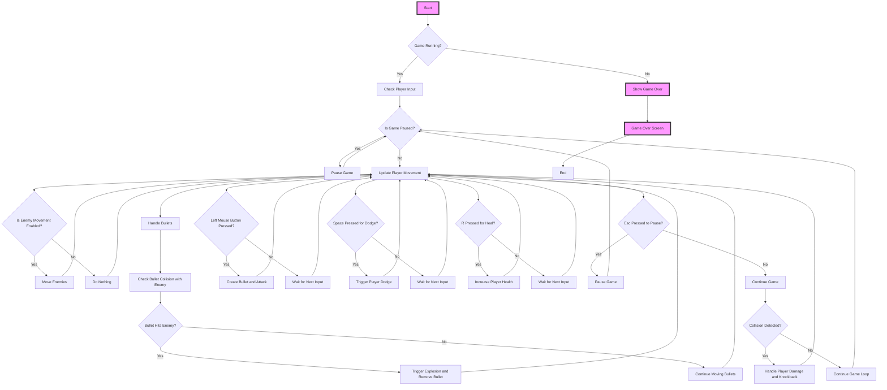
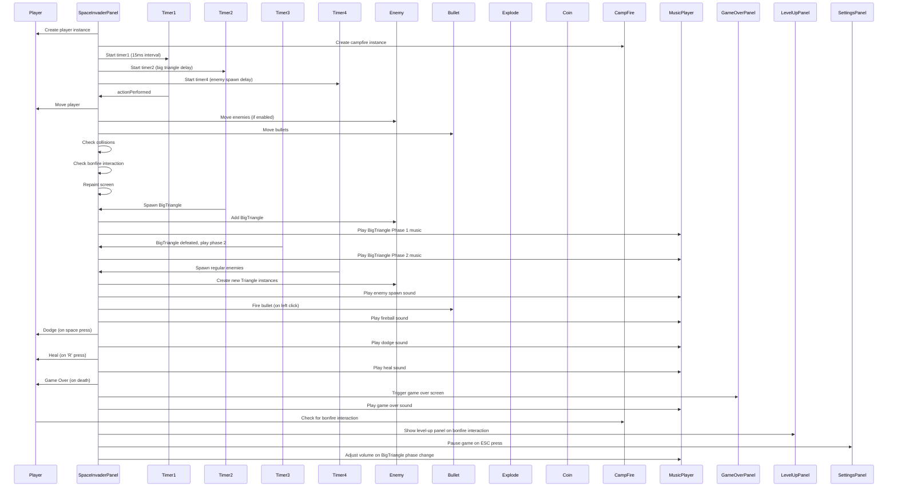

# [Space Invader](https://hackmd.io/01ZzylXsT1GonHUKVohs9A)

## 一、Space Invader 基礎功能列表

此文件列出實作 Space Invader 遊戲時的 12 項基本功能模組，供遊戲開發規劃與專案分工參考。

---

### ✅ 1. 遊戲初始化與畫面佈局
- 建立遊戲視窗（設定大小、標題、背景顏色）。
- 載入素材（圖片、音效、字型等資源）。

---

### ✅ 2. 玩家控制（左右移動、發射子彈）
- 鍵盤輸入控制（如：←/→ 或 A/D 移動）。
- 空白鍵發射子彈（可加發射間隔限制）。

---

### ✅ 3. 敵人生成與排列
- 敵人以陣列形式生成（多列多行）。
- 可依關卡難度調整敵人數量或分佈。

---

### ✅ 4. 敵人移動邏輯
- 敵人群體橫向移動。
- 碰到邊界時群體向下移動並反向。

---

### ✅ 5. 敵人發射子彈
- 敵人可隨機或依時間間隔發射子彈。
- 子彈往下移動，攻擊玩家。

---

### ✅ 6. 碰撞偵測（玩家子彈 vs 敵人）
- 子彈擊中敵人：敵人死亡、子彈消失。
- 可加入爆炸動畫與音效。

---

### ✅ 7. 碰撞偵測（敵人子彈 vs 玩家 / 敵人接觸玩家）
- 玩家被子彈擊中扣血，死亡時遊戲結束。

---

### ✅ 8. 得分系統
- 擊敗敵人可獲得分數。
- 分數顯示於畫面。

---

### ✅ 9. 生命值與遊戲結束條件
- 玩家擁有初始生命值（例如 3 條命）。
- 無生命或敵人到底即觸發 Game Over。

---

### ✅ 10. 關卡系統
- 每波敵人結束後進入下一關。
- 敵人速度提升、排列變化增加難度。

---

### ✅ 11. 音效與背景音樂
- 包含射擊聲、爆炸聲、關卡背景音樂。
- 可支援靜音或音量調整選項。

---

### ✅ 12. 主選單與重新開始功能
- 顯示開始畫面、操作說明、製作人員。
- Game Over 畫面提供重新開始或退出選項。

---

## 二、UML 類別圖 (Class Diagram)

```mermaid
classDiagram
    class Constants {
        <<static>>
        +int FRAMEWIDTH
        +int FRAMEHEIGHT
        +int PLAYERWIDTH
        +int PLAYERHEIGHT
        +int PLAYERMAXLEVEL
        +int PLAYERESTUSNUM
        +int PLAYERINITIALEXP
        +int TRIANGLEWIDTH
        +int TRIANGLEHEIGHT
        +int TRIANGLEATTACKSTARTTIME
        +int TRIANGLEATTACKENDTIME
        +int TRIANGLEATTACKCOOLDOWN
        +int SMALLTRIANGLEDETECTZONE
        +int TRIANGLEDETECTZONE
        +int BIGTRIANGLEDETECTZONE
        +int playerHPLevel
        +int playerHPLevelTemp
        +double playerActualHP
        +int playerSTRLevel
        +int playerSTRLevelTemp
        +double playerActualSTR
        +int playerDEXLevel
        +int playerDEXLevelTemp
        +double playerActualDEX
        +double playerActualEnergy
        +double playerActualSpeed
        +int levelUpCost
        +float currentVolume
        +int nRuns

        +double getActualHP()
        +double getActualSTR()
        +double getActualDEX()
        +double getActualEnergy()
        +double levelUpCost()
        +double nextLevelUpCost()
    }

    class Player {
        -double x
        -double y
        -final int width
        -final int height
        -final Color color
        -int speed
        -int currentHealth
        -double currentEnergy
        -int exp
        -int estus
        -boolean invincible
        -boolean attacking
        -boolean healing
        -int attackCoolDown
        -int healingTimer
        -int healingCoolDown
        -boolean dodging
        -int dodgeTimer
        -int dodgeCoolDown
        +double dodgedx
        +double dodgedy
        +double dodgeSpeed
        -boolean knockBacking
        +double knockBackdx
        +double knockBackdy
        +int knockBackSpeed
        +int knockBackTimer
        +int knockBackCoolDown

        +Player(int, int, int, int, Color, int, int)
        +void move(boolean, boolean, boolean, boolean)
        +void dodge(boolean, boolean, boolean, boolean)
        +void knockBack(double, double, int, int)
        +void attack()
        +void getHurt(int)
        +boolean isAttacking()
        +boolean isKnockBacking()
        +boolean isDodging()
        +boolean isHealing()
        +boolean isInvincible()
        +void draw(Graphics)
        +int getHealth()
        +void increaseHealth()
        +void restoreHealth()
        +void restoreEnergy()
        +int getEstus()
        +void restoreEstus()
        +void increaseExp(int)
        +void decreaseExp(int)
        +int getExp()
        +int getEnergy()
        +double getX()
        +double getY()
        +double getCenterX()
        +double getCenterY()
        +int getWidth()
        +Rectangle getBounds()
    }
    
    Player --> Constants
    
    class PlayerUI {
        +static void draw(Graphics g, int maxHealth, int currentHealth, int maxEnergy, int currentEnergy, int exp, int estus)
    }
    
    PlayerUI --> Player

    class Enemy {
        - double x
        - double y
        - int width
        - int height
        - Color oriColor
        - Color color
        - int maxHealth
        - int currentHealth
        - int speed
        - int state
        - boolean attacking
        - boolean knockBacking
        - boolean damagePlayer
        - boolean getHurting
        - int getHurtCounter
        - int getHurtTimer
        - int attackDamage
        - double knockBackdx
        - double knockBackdy
        - int knockBackSpeed
        - int knockBackTimer
        - int detectZone
        + Enemy()
        + Enemy(int, int, int, int, Color, int, int, int)
        + void move(double, double)
        + void stateIdle(double, double)
        + void stateMove(double, double)
        + void stateKnockBack()
        + void getHurt(int)
        + void knockBack(double, double, int, int)
        + void draw(Graphics)
        + double getCenterX()
        + double getCenterY()
        + double getMaxHealth()
        + double getHealth()
        + int getDamage()
        + boolean isAttacking()
        + Rectangle getBounds()
    }
    
    Enemy --> Constants

    class Triangle {
        + double centerX
        + double centerY
        + double dx
        + double dy
        + int[] xPoints
        + int[] yPoints
        + double attackdx
        + double attackdy
        + int attackSpeed
        + int attackTimer
        + int attackStartTime
        + int attackEndTime
        + int attackCoolDown
        + Triangle(int, int, int, int, Color, int, int, int)
        + void move(double, double)
        + void stateIdle(double, double)
        + void stateMove(double, double)
        + void stateKnockBack()
        + void stateAttack(double, double)
        + void rotateTri()
        + void draw(Graphics)
        + double getCenterX()
        + double getCenterY()
        + double getHealth()
        + boolean isAttacking()
        + Rectangle getBounds()
    }

    Triangle --|> Enemy
    Triangle --> Constants
    
    class BigTriangle {
        - int phase
        - int moveType
        - int moveTypeTimer
        - int attackType
        - int attackTypeCounter
        - double rotationRadius
        - int rotateDirection
        - boolean isSummoned
        - int phaseChangeTimer
        - List<Enemy> enemiesToAdd
        + BigTriangle(int x, int y, int w, int h, Color c, int attackDamage, int health, int detectZone)
        + void move(double playerX, double playerY)
        + void draw(Graphics g)
        + void stateIdle(double playerX, double playerY)
        + void stateMove(double playerX, double playerY)
        + void stateAttack(double playerX, double playerY)
        + void statePhaseChange()
        + void getHurt(int damage)
        + int getDamage()
        + void stateKnockBack()
        + void knockBack(double x, double y, int s, int t)
        + void sprintAttack(double playerX, double playerY)
        + void heavyAttack(double playerX, double playerY)
        + void sprintsprintAttack(double playerX, double playerY)
        + void summonTriangleMinions(int num)
        + int getPhase()
    }
    
    BigTriangle --|> Triangle
    BigTriangle --> Constants

    class Bullet {
        - double x
        - double y
        - int width
        - int height
        - Color color
        - int speed
        - int damage
        - double dx
        - double dy
        + Bullet(int x, int y, int w, int h, Color c, double dx, double dy)
        + void move()
        + int getDamage()
        + boolean outOfScreen()
        + int getWidth()
        + int getHeight()
        + void draw(Graphics g)
        + Rectangle getBounds()
    }
    
    Bullet --> Player
    
    class Coin {
        - double x
        - double y
        - int width
        - int height
        - int exp
        - Color color
        - int[] xPoints
        - int[] yPoints
        - double dx
        - double dy
        + Coin(double x, double y, int exp)
        + void move()
        + void draw(Graphics g)
        + int getExp()
        + Rectangle getBounds()
    }
    
    Coin --> Player

    class CampFire {
        - int x
        - int y
        - int width
        - int interactWidth
        - int height
        + CampFire(int x, int y)
        + void draw(Graphics g)
        + void drawText(Graphics g)
        + int getCenterX()
        + int getCenterY()
        + int getWidth()
        + Rectangle getBounds()
    }
    
    CampFire --> Player

    class Explode {
        -double x
        -double y
        -double centerX
        -double centerY
        -double width
        -double height
        -double w
        -double h
        -Color color
        -int damage = 15
        -int maxHealth = 0
        -int currentHealth = 0
        +Explode(int x, int y, int w, int h, Color c, int health)
        +void getHurt(int damage)
        +void draw(Graphics g)
        +int getDamage()
        +double getCenterX()
        +double getCenterY()
        +double getHealth()
        +Rectangle getBounds()
    }
    
    Explode --> Bullet

    class SpaceInvaderPanel {
        -Timer timer1
        -Timer timer2
        -Timer timer3
        -Timer timer4
        -ArrayList~Enemy~ enemies
        -ArrayList~Bullet~ bullets
        -List~Enemy~ enemiesToAdd
        -ArrayList~Explode~ explodes
        -ArrayList~Coin~ coins
        -Player player
        -CampFire campFire
        -boolean paused
        -boolean playerInput
        -boolean enemyMove
        -boolean isGameOver
        -boolean showBonfireText
        -boolean inBonfire
        -int spawnEnemiesMaxDelay
        -int spawnEnemiesMinDelay
        -int spawnEnemiesDelay
        -int spawnEnemiesStep
        -int bigTriangleDelay
        -boolean stopSpawmEnemies
        -boolean enemyFall
        -boolean changeMusic
        -boolean wPressed
        -boolean aPressed
        -boolean sPressed
        -boolean dPressed
        -boolean ePressed
        -boolean escPressed
        -int rPressed
        -int spacePressed
        -int mouseLeftClicked
        -int mouseRightClicked
        -int leftClickX
        -int leftClickY
        -JLayeredPane layeredPane
        -JPanel settingsPanel
        -GameOverPanel gameOverPanel
        -LevelUpPanel levelUpPanel
        -MusicPlayer musicPlayer
        +SpaceInvaderPanel(JLayeredPane lp)
        +void spawnEnemies()
        +void paintComponent(Graphics g)
        +void actionPerformed(ActionEvent e)
        +void checkCollisions()
        +void deleteOutOfScreenBullets()
        +void pauseGame()
        +void resumeGame()
        +void restartGame()
        +void disablePlayerInput()
        +void keyPressed(KeyEvent e)
        +void keyReleased(KeyEvent e)
        +void keyTyped(KeyEvent e)
        +void mousePressed(MouseEvent e)
        +void mouseClicked(MouseEvent e)
        +void mouseEntered(MouseEvent e)
        +void mouseExited(MouseEvent e)
        +void mouseReleased(MouseEvent e)
        +void setSettingsPanel(SettingsPanel settingPanel)
        +void setGameOverPanel(GameOverPanel gameOverPanel)
        +void setLevelUpPanel(LevelUpPanel levelUpPanel)
        +void setMusicPlayer(MusicPlayer musicPlayer)
    }

    class StartPanel {
        -SettingsPanel settingsPanel
        -MusicPlayer musicPlayer
        +StartPanel(SpaceInvaderPanel gamePanel, MusicPlayer musicPlayer)
        +void styleTextOnlyButton(JButton button)
        +void setSettingsPanel(SettingsPanel settingPanel)
        +void setMusicPlayer(MusicPlayer musicPlayer)
    }

class SettingsPanel {
        -StartPanel startPanel
        -JLayeredPane layeredPane
        -boolean isBlackBackground
        -boolean showResumeButton
        -MusicPlayer musicPlayer
        -JButton resumeButton

        +SettingsPanel(SpaceInvaderPanel gamePanel, StartPanel startPanel, JLayeredPane layeredPane, MusicPlayer musicPlayer)
        +JPanel createVolumeControlPanel()
        +void customizeButton(JButton button)
        +void styleTextOnlyButton(JButton button)
        +void setBlackBackground(boolean isBlackBackground)
        +void setStartPanel(StartPanel startPanel)
        +void setMusicPlayer(MusicPlayer musicPlayer)
        +void showResumeButton(boolean show)
        +void paintComponent(Graphics g)
    }
    
    class LevelUpPanel {
        -boolean confirmLevelUp
        -SpaceInvaderPanel gamePanel
        -MusicPlayer musicPlayer
        -JLabel hpTextLabel
        -JLabel strTextLabel
        -JLabel dexTextLabel
        -JLabel totalLevelLabel
        -JLabel nextLevelUpCostLabel
        -JLabel currentExpLabel

        +LevelUpPanel(SpaceInvaderPanel gamePanel, MusicPlayer musicPlayer)
        +JPanel createLevelInfoPanel()
        +JPanel createLevelControlPanel()
        +JPanel createConfirmExitPanel()
        +void addHPUI(JPanel panel)
        +void addSTRUI(JPanel panel)
        +void addDEXUI(JPanel panel)
        +void setupStatPanel(JPanel panel, String labelName, StatGetter baseLevelGetter, StatGetter tempLevelGetter, StatSetter tempLevelSetter, StatLabelSetter textSetter, StatLabelGetter labelGetter)
        +void confirmLevelUp()
        +void exitLevelUp()
        +void updateLevelInfo()
        +void styleTextOnlyButton(JButton button)
        +void paintComponent(Graphics g)
        +void setMusicPlayer(MusicPlayer musicPlayer)
    }
    
    class GameOverPanel {
        -float alpha
        -Timer fadeTimer
        -Timer restartTimer
        -SpaceInvaderPanel gamePanel
        -MusicPlayer musicPlayer
        
        +GameOverPanel(SpaceInvaderPanel gamePanel, MusicPlayer musicPlayer)
        +void triggerFadeIn()
        +void paintComponent(Graphics g)
    }
    
    class MusicPlayer {
        -Map<String, List<Clip>> clipPool
        -float currentVolume
        +MusicPlayer()
        +void load(String id, String filepath, int count)
        +void playSegment(String id, float startSec, float endSec, boolean loop)
        +void stopById(String id)
        +void stopAll()
        +void adjustVolume(float delta)
        +void setVolume(float v)
        +float getCurrentVolume()
        +String getVolumeText()
        -void applyVolume(Clip clip)
    }
    
    
    
    SpaceInvaderPanel --> SettingsPanel
    SpaceInvaderPanel --> LevelUpPanel
    SpaceInvaderPanel --> GameOverPanel
    
    StartPanel --> SpaceInvaderPanel
    SettingsPanel --> SpaceInvaderPanel
    LevelUpPanel --> SpaceInvaderPanel
    GameOverPanel --> SpaceInvaderPanel
    
    SpaceInvaderPanel --> MusicPlayer
    StartPanel --> MusicPlayer
    SettingsPanel --> MusicPlayer
    LevelUpPanel --> MusicPlayer
    GameOverPanel --> MusicPlayer
    
    SpaceInvaderPanel --> Constants
    SettingsPanel --> Constants
    LevelUpPanel --> Constants
    GameOverPanel --> Constants

```

## 三、流程圖 (Flow Chart)

## 四、序列圖 (Sequence Diagram)

